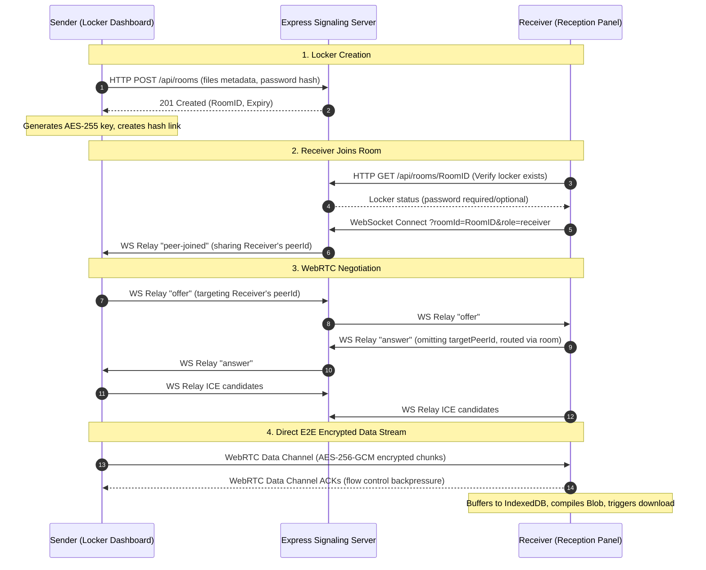

# 🚀 SendFiles P2P: Secure Zero-Configuration Sharing

SendFiles P2P is a state-of-the-art, zero-configuration peer-to-peer file sharing application. It enables instant device discovery on local networks and secure, direct-channel file transfers via WebRTC. For restrictive NAT networks, it automatically rolls back to an asynchronous WebSocket chunk relay.

The frontend is styled in a glassmorphic dark-theme using React 19, Tailwind CSS v4, and Motion. The backend is an Express Node server that acts as a WebSocket signaling gateway and provides a public IP discovery mechanism.

---

## ✨ Primary Capabilities

### ⚡ Direct Beam (Instant P2P)
- **Zero Configuration**: Connect from two devices on the same Wi-Fi network and they will instantly pair based on their public IP.
- **Slick Interface**: Discover nearby or remote peers, select a node, and drop files to stream them instantly.
- **Dynamic Updates**: Real-time presence reporting when devices join or leave the network registry.

### 🔒 Encrypted Locker Vaults (Zero-Knowledge)
- **Multi-File Envelopes**: Bundle multiple files into a single locker.
- **Client-Side Cryptography**: Files are symmetrically encrypted chunk-by-chunk in the browser using **AES-256-GCM** via the Web Cryptography API.
- **Zero-Knowledge Distribution**: The 256-bit decryption key is appended to the URL hash (e.g. `#/locker/ID#key=HEX_KEY`). Because hash parameters are client-side only, **the decryption key never touches the network or the backend**.
- **Destruct Rules**: Configure download limit quotas (1 to 50 downloads, or unlimited) and expiration timers (10 minutes to 24 hours). Once conditions are met, the locker state is pruned from the server.
- **Passcode Protection**: Add an optional secondary passcode hashed with **SHA-256** client-side to verify receiver identity before initiating WebRTC handshakes.

### 📊 Performance & Scaling
- **IndexedDB Buffering**: Bypasses browser heap memory limitations by buffering file chunks directly onto client disk storage. This enables transfers of huge files (10GB+) without tab crashes.
- **Backpressure Throttle**: Monitors WebRTC datachannel buffer congestion (`RTCDataChannel.bufferedAmount`). Transmissions are dynamically throttled if the queue exceeds 1MB to prevent receiver packet drop.
- **Throughput Charts**: Renders smooth, canvas-based line graphs representing real-time transfer speeds and calculating accurate ETAs.

---

## 📐 Systems Architecture

### WebRTC Room Signaling Flow



---

## 🛠️ Local Configuration & Development

Follow these steps to spin up the local development server:

### Prerequisites
- [Node.js](https://nodejs.org/) (Version 18 or higher recommended)

### Installation
1. **Clone the repository files** and enter the workspace directory.
2. **Install node dependencies**:
   ```bash
   npm install
   ```
3. **Start the local server**:
   ```bash
   npm run dev
   ```
   This command starts the Express backend and runs the Vite middleware concurrently on port `3000`.
4. **Access the application**:
   Open [http://localhost:3000](http://localhost:3000) in your web browser.

### Testing Across Local Wi-Fi Devices
To share files between a computer and a mobile device:
1. Make sure both devices are connected to the **exact same Wi-Fi network**.
2. Find the local IPv4 address of your host machine (e.g. `192.168.1.50`).
3. Open the browser on your mobile device and navigate to: `http://192.168.1.50:3000`.
4. The devices will instantly discover each other in the **Direct Beam** tab.

---

## 🏗️ Production Build & Hosting

To build a production bundle and run the server:

```bash
npm run build
npm start
```

### Hosting Considerations
Because the application relies on persistent WebSocket connections for signaling and room matching:
- **Recommended Hosts**: Google Cloud Run, Railway, Render, Fly.io, Heroku, or VPS nodes.
- **Serverless Warning**: Do not host the Express backend on standard serverless architectures (like static Vercel / Netlify functions) because they do not support persistent WebSocket connections and will drop signaling channels.
- **HTTPS/WSS**: Ensure your hosting environment is behind an SSL termination proxy. In production, WebRTC requires secure origins (`https://` and `wss://`) to allow camera, microphone, and direct datachannel handshakes.

---

## 🔒 Security Specifications

1. **Symmetric Encryption**: Files are sliced and encrypted using AES-GCM (256-bit key).
2. **Ephemeral Keys**: Encryption keys are stored in the URL hash segment. Since browsers do not send hash parameters to servers, the signaling server has **zero-knowledge** of file content.
3. **Hashing Security**: Locker passcodes are processed using SHA-256. Only the resulting hash is sent to the server for room authorization verification.
