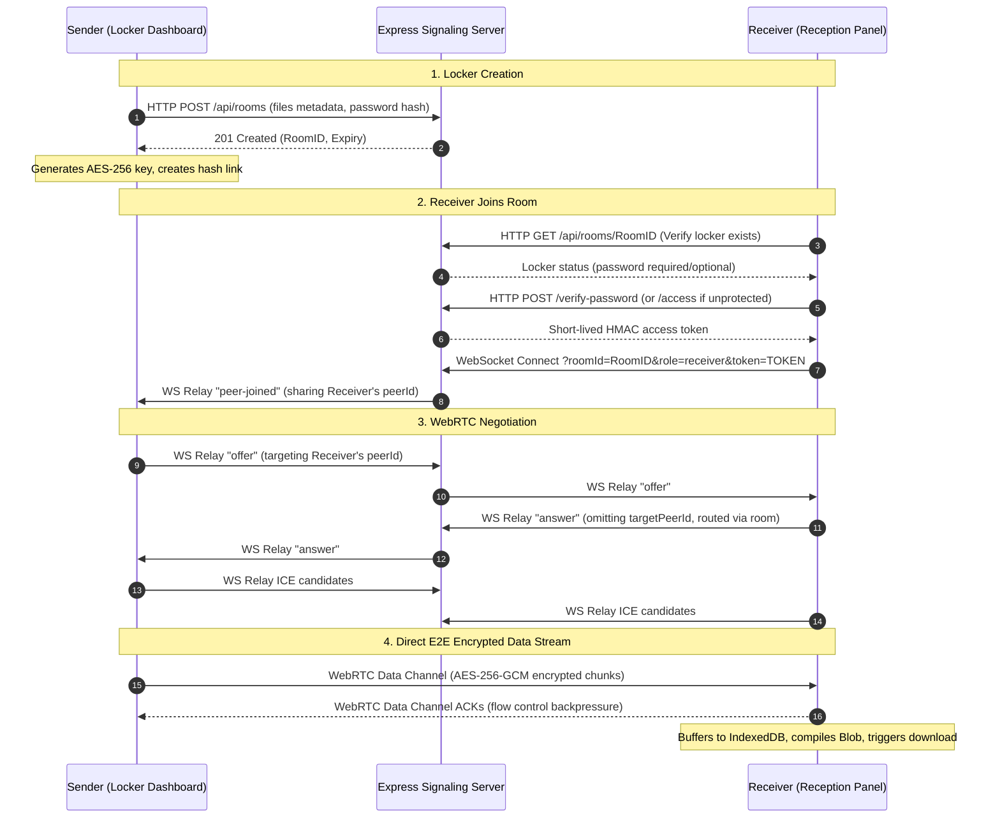

# SendFiles P2P: Secure Zero-Configuration File Sharing

SendFiles P2P is a zero-configuration peer-to-peer file sharing application. It enables instant device discovery on local networks and secure, direct-channel file transfers via WebRTC. For networks with restrictive NAT configurations, the application automatically rolls back to an asynchronous WebSocket chunk relay.

The frontend is a single-page application built on React 19 and Tailwind CSS v4. The backend is an Express server acting as a WebSocket signalling gateway, with an optional Electron shell that wraps both into a desktop application.

---

## Primary Capabilities

### Direct Beam (Instant P2P)
- **Zero Configuration**: Devices connected to the same Wi-Fi network discover and pair with each other automatically.
- **Scoped Discovery**: The server decides which peers each client may see and sends only those. Discovery scope is controlled by `DISCOVERY_MODE` (`lan` / `strict` / `off`) and never spans unrelated networks.
- **Per-Transfer Key Agreement**: Sender and receiver derive a shared AES-256-GCM key over ECDH (P-256) before any bytes move, so chunks stay encrypted even when the transfer falls back to the WebSocket relay. Both devices display a six-digit safety code to compare.
- **Dynamic Presence**: Updates the peer registry in real-time as devices join or leave the signaling channel.

### Encrypted Locker Vaults (Zero-Knowledge)
- **Multi-File Packages**: Allows bundling multiple files into a single locker envelope.
- **Client-Side Cryptography**: Files are encrypted in-browser chunk-by-chunk using AES-256-GCM via the Web Cryptography API.
- **Zero-Knowledge Architecture**: The 256-bit symmetric decryption key is appended to the URL hash segment (e.g., `#/locker/ID#key=HEX_KEY`). Because browsers do not transmit hash fragments to servers, the decryption key remains strictly client-side.
- **Self-Destruct Constraints**: Supports download limit quotas and expiration timers (10 minutes to 24 hours). A "download" counts one receiver completing the entire locker, not one file. Once conditions are met, the locker registry is pruned from the server.
- **Passcode Authentication**: An optional secondary passcode, stretched client-side with PBKDF2-HMAC-SHA256 (600,000 iterations) over a random 16-byte salt. The cleartext passcode never leaves the browser. On success the server issues a short-lived HMAC access token, and that token — not the client's own say-so — is what admits a receiver to the locker's signalling room.

### Performance & Scaling
- **IndexedDB Buffering**: Caches incoming file chunks directly onto client disk storage via IndexedDB. This bypasses browser heap memory constraints, enabling transfers of large files (10GB+) without memory exhaustion.
- **Flow Control (Backpressure)**: Monitors WebRTC data channel congestion (`RTCDataChannel.bufferedAmount`). Transmissions are paused when the buffer exceeds 1MB and resumed once it drains, preventing packet loss.
- **Progress Metrics**: Estimates and displays accurate real-time transfer progress, speed, and remaining time (ETA).

---

## Systems Architecture

### WebRTC Room Signaling Flow


```mermaid
sequenceDiagram
    autonumber
    participant Sender as Sender (Locker Dashboard)
    participant Server as Express Signaling Server
    participant Receiver as Receiver (Reception Panel)

    Note over Sender,Receiver: 1. Locker Creation
    Sender->>Server: HTTP POST /api/rooms (files metadata, password hash)
    Server-->>Sender: 201 Created (RoomID, Expiry)
    Note over Sender: Generates AES-256 key, creates hash link
    
    Note over Sender,Receiver: 2. Receiver Joins Room
    Receiver->>Server: HTTP GET /api/rooms/RoomID (Verify locker exists)
    Server-->>Receiver: Locker status (password required/optional)
    Receiver->>Server: HTTP POST /verify-password (or /access if unprotected)
    Server-->>Receiver: Short-lived HMAC access token
    Receiver->>Server: WebSocket Connect ?roomId=RoomID&role=receiver&token=TOKEN
    Server->>Sender: WS Relay "peer-joined" (sharing Receiver's peerId)
    
    Note over Sender,Receiver: 3. WebRTC Negotiation
    Sender->>Server: WS Relay "offer" (targeting Receiver's peerId)
    Server->>Receiver: WS Relay "offer"
    Receiver->>Server: WS Relay "answer" (omitting targetPeerId, routed via room)
    Server->>Sender: WS Relay "answer"
    Sender->>Server: WS Relay ICE candidates
    Receiver->>Server: WS Relay ICE candidates
    
    Note over Sender,Receiver: 4. Direct E2E Encrypted Data Stream
    Sender->>Receiver: WebRTC Data Channel (AES-256-GCM encrypted chunks)
    Receiver-->>Sender: WebRTC Data Channel ACKs (flow control backpressure)
    Note over Receiver: Buffers to IndexedDB, compiles Blob, triggers download
```

---

## Local Configuration & Development

To run the application locally, follow these steps:

### Prerequisites
- Node.js (Version 18 or higher recommended)

### Installation & Launching

#### Option A: Desktop Application (Recommended)
A normal windowed application. It runs the sharing server in the background and shows the interface in its own window; other devices on your Wi-Fi connect to the LAN address displayed inside the app.

1. Open the **GitHub Releases** page of this repository.
2. Download the build for your operating system:
   - **Windows (installer)**: `SendFiles-Setup.exe`
   - **Windows (no install)**: `SendFiles-portable.exe`
   - **Linux**: `SendFiles-x86_64.AppImage`
   - **macOS**: `SendFiles-arm64.dmg` (Apple Silicon) or `SendFiles-x64.dmg` (Intel)
3. Launch it. No Node.js installation is required.

These builds are not code-signed. Windows SmartScreen shows "Windows protected your PC" on first run: choose **More info**, then **Run anyway**. On macOS, right-click the app and choose **Open** the first time.

#### Option B: Standalone Executables (Console)
A single-file program that starts the server and opens your default browser. It leaves a terminal window open for as long as it runs.

1. Open the **GitHub Releases** page of this repository.
2. Download the pre-compiled standalone binary for your operating system:
   - **Windows**: `sendfiles-windows.exe`
   - **Linux**: `sendfiles-linux`
   - **macOS**: `sendfiles-macos-intel` or `sendfiles-macos-silicon`
3. Double-click the executable to launch. It boots the server, resolves network IPv4 addresses, and opens your web browser.

If port 3000 is already taken, SendFiles moves to the next free port and prints the address it selected. Set `PORT` and `HTTPS_PORT` to choose your own.

#### Option C: One-Click Source Launchers (Simplified)
For running from source code with automatic dependency resolution:
- **Windows**: Double-click the `run-windows.bat` launcher in the project root.
- **Linux / macOS**: Run the launcher from your terminal:
  ```bash
  chmod +x run-linux.sh
  ./run-linux.sh
  ```

#### Option D: Manual Commands
1. Clone the repository and navigate into the project directory.
2. Install the Node dependencies:
   ```bash
   npm install
   ```
3. Start the development server:
   ```bash
   npm run dev
   ```
   This compiles the frontend assets and starts the Express signaling server on port 3000.
4. Access the application:
   Open http://localhost:3000 in your browser.

### Testing Across Local Wi-Fi Devices
To test file sharing between two local devices:
1. Ensure both devices are connected to the same Wi-Fi network.
2. Identify the local IPv4 address of the host machine (e.g., `192.168.1.50`).
3. Open the browser on your mobile or secondary device and navigate to: `http://192.168.1.50:3000`.
4. The two devices will pair and appear in each other's Direct Beam discovery tab.

### Configuration Reference

All of these are optional. Copy `.env.example` to `.env` to set them, or pass
them as environment variables.

| Variable | Default | Purpose |
| --- | --- | --- |
| `PORT` | `3000` | HTTP listen port. If taken, the next free port is used. |
| `HTTPS_PORT` | `3001` | HTTPS listen port, same fallback behaviour. |
| `TRUST_PROXY` | unset | Number of reverse proxies in front of the app, or `true` to trust every hop. Required on any hosted deployment. |
| `DISCOVERY_MODE` | auto | `lan`, `strict` or `off`. Defaults to `lan` on a desktop or packaged build and `strict` everywhere else. |
| `MAX_CONNECTIONS_PER_IP` | `64` | Concurrent signalling sockets allowed from one address. Raise it if many users share a NAT. |
| `ROOM_TOKEN_SECRET` | random | HMAC secret for locker access tokens. Set it to keep tokens valid across restarts and across instances. |
| `OFFLINE_MODE` | unset | `true` disables public STUN servers for a strictly offline LAN, avoiding WebRTC timeouts. |
| `STUN_SERVER_URL` | unset | Additional STUN server. |
| `TURN_SERVER_URL` | unset | TURN server URL; also set `TURN_SERVER_USERNAME` and `TURN_SERVER_CREDENTIAL`. |
| `REDIS_URL` | unset | Enables shared locker state, cross-instance relay and a cluster-wide peer directory. |
| `NO_OPEN` | unset | `true` stops the server opening a browser on start. |
| `VITE_SIGNALING_SERVER` | unset | Build-time only. Points a statically hosted frontend at a separate signalling backend. |

---

## Desktop Application

The desktop build is an Electron shell around the same server and web UI, not a
separate implementation.

### How it works

SendFiles is a server that other devices connect to, so the desktop app cannot
simply embed the interface and drop the server. Instead:

1. The Electron main process spawns `server.cjs` as a child process, using
   Electron's own binary in Node mode (`ELECTRON_RUN_AS_NODE`), so no separate
   Node.js runtime is shipped.
2. The server binds a port, falling forward if the preferred one is taken, and
   prints a `SENDFILES_READY` line containing the ports it actually bound.
3. The main process reads that line and loads the URL in a `BrowserWindow`.
4. The server keeps serving the LAN for as long as the window is open, so phones
   and other machines still reach it at the network address shown in the app.

Closing the window stops the server. Launching a second copy focuses the
existing window rather than starting a competing server.

### Security posture

The renderer is locked down along the lines recommended by the Electron project:

| Setting | Value |
| --- | --- |
| `contextIsolation` | enabled |
| `nodeIntegration` | disabled |
| `sandbox` | enabled |
| `webSecurity` | enabled |
| `allowRunningInsecureContent` | disabled |

- The preload script exposes exactly three read-only IPC calls through
  `contextBridge`: server info, LAN URL, and app version. Nothing in the bridge
  touches the filesystem or spawns a process.
- Navigation is pinned to the local server origin. `window.open` is denied, and
  external `https://` links are handed to the system browser via
  `shell.openExternal`.
- Webview attachment is blocked and all permission requests (camera, microphone,
  geolocation) are denied.
- A strict Content Security Policy is injected as a response header for the app
  session only, so the browser-hosted deployment is unaffected.

### Automatic updates

The desktop app checks the GitHub releases feed shortly after launch and once
a day thereafter.

- Nothing downloads without asking. An available update prompts first.
- Downloads happen in the background and install on quit, so an update never
  interrupts a transfer that is in progress.
- A failed or offline check is logged and otherwise ignored; it never
  interrupts the person using the app.
- **Help > Check for Updates** triggers a check on demand.

**macOS is excluded.** Squirrel.Mac refuses to update an application that is
not code-signed, and these builds are not signed. Rather than fail obscurely,
macOS users get a dialog pointing at the releases page. Signing the app would
enable automatic updates there too.

Updates are driven by the `latest.yml` and `latest-linux.yml` manifests that
electron-builder generates and the release workflow attaches to each release.
A release published without those files will simply report no update
available.

### Building it yourself

```bash
npm install
npm run electron:dev     # build everything and launch the app
npm run electron:pack    # produce installers for the current platform
```

Packaged output lands in `release-desktop/`. Installer formats have to be built
on their own operating system, which is why CI runs the desktop job on a
Windows, Linux and macOS matrix.

The server and its web assets are deliberately kept out of the asar archive and
unpacked to `resources/server`, because Node cannot execute a file from inside
an asar.

---

## Production Build & Hosting

To build the static bundle and start the production server:

```bash
npm run build
npm start
```

To compile standalone executables locally:

```bash
npm run package
```

### Hosting Guidelines
Because the signaling channel relies on persistent WebSocket connections:
- **Recommended Providers**: Google Cloud Run, Railway, Render, Fly.io, Heroku, or virtual private servers (VPS).
- **Serverless Warning**: Standard serverless platforms (such as static Vercel or Netlify configurations) do not support persistent WebSockets and are not suitable for hosting the Express signaling backend.
- **HTTPS/WSS Requirements**: WebRTC APIs require secure contexts. In production, ensure the server is behind an SSL termination proxy so that assets are served over HTTPS and WebSockets dial over WSS.

#### Required configuration for a public deployment

All of these are behind a reverse proxy, so none of them are optional:

```bash
TRUST_PROXY=1            # number of proxies in front of the app
DISCOVERY_MODE=strict    # or "off" for link-only lockers
ROOM_TOKEN_SECRET=...    # 32+ random bytes; required for multi-instance
```

The server prints its resolved discovery mode and proxy setting at startup and warns when the combination looks unsafe. Check that banner after your first deploy.

If you serve the frontend separately from the signalling backend, set `VITE_SIGNALING_SERVER` at build time. There is no built-in remote fallback: if signalling is not configured and not same-origin, the connection fails loudly rather than quietly routing your traffic somewhere you did not choose.

---

## Security Specifications

1. **Symmetric Encryption**: Chunks are encrypted with AES-256-GCM, with a fresh random 12-byte IV per chunk. This applies to both transfer modes and to both the direct WebRTC path and the WebSocket relay fallback.
2. **Ephemeral Key Distribution (Lockers)**: The key lives solely in the URL hash fragment. Browsers do not send hash fragments to servers, so the backend never sees it.
3. **Key Agreement (Direct Beam)**: There is no shared link for Direct Beam, so both sides derive a key via unauthenticated ECDH on P-256 and the server sees only public keys.
4. **Password Security**: Passcodes are stretched with PBKDF2-HMAC-SHA256 (600,000 iterations, random 16-byte salt) client-side. Only the derived digest is sent, compared in constant time, and rate limited.
5. **Signalling Authorisation**: Peer IDs are 128-bit CSPRNG values. The server refuses ID collisions, binds relayed frames to the authenticated connection, and only relays between peers in the same locker room or the same discovery scope.

### Threat model — please read before trusting this with something sensitive

- **The signalling server is trusted not to actively tamper.** Direct Beam's ECDH is *unauthenticated*: a malicious or compromised server could substitute its own public keys and read the transfer. The six-digit safety code shown on both devices exists so two people can detect exactly that — compare it out of band before sending anything sensitive.
- **Anyone holding a locker link holds the data.** The key is in the URL. Treat the link itself as the secret; the passcode is a second factor against link leakage, not a substitute.
- **`DISCOVERY_MODE` matters on a public host.** Deploying with `lan` behind a reverse proxy places every visitor in one discovery group. The default is `strict` for non-desktop hosts; do not override it without understanding why.
- **Set `TRUST_PROXY` when behind a proxy.** Otherwise every client resolves to the proxy's address, which degrades both rate limiting and discovery scoping.
- **No forward secrecy across sessions for lockers**; the locker key is generated per locker and lives as long as the link does.

---

## Known Limitations

Current, honest constraints. None of these are bugs to be reported; they are
design trade-offs or unfinished work.

- **Direct Beam key agreement is unauthenticated.** A malicious signalling
  server could substitute its own keys. Comparing the six-digit safety code
  shown on both devices is the mitigation, and it is a manual step.
- **Relay throughput is stop-and-wait.** The WebSocket fallback waits for an
  acknowledgement per 1 MB chunk, so throughput is bounded by round-trip
  latency. A windowed scheme would help if the relay path matters to you.
- **Transfer resume is not implemented.** The protocol carries a
  `resumeChunkIndex` field that is always sent as zero. An interrupted
  transfer restarts the current file.
- **Desktop builds are not code-signed.** Windows SmartScreen and macOS
  Gatekeeper will warn on first run. Signing requires a purchased certificate.
- **`pkg` is archived upstream.** It is used only at release time to produce
  the console binaries and carries one unfixable moderate advisory. It is a
  development dependency and is not part of anything shipped to users. The
  alternatives are to drop the console binaries in favour of the desktop app
  and portable packages, or to migrate to Node's built-in single-executable
  support.
- **License headers say Apache-2.0 while `LICENSE` is MIT.** This predates the
  current work and has been left alone deliberately, since which one is
  intended is the maintainer's call.
